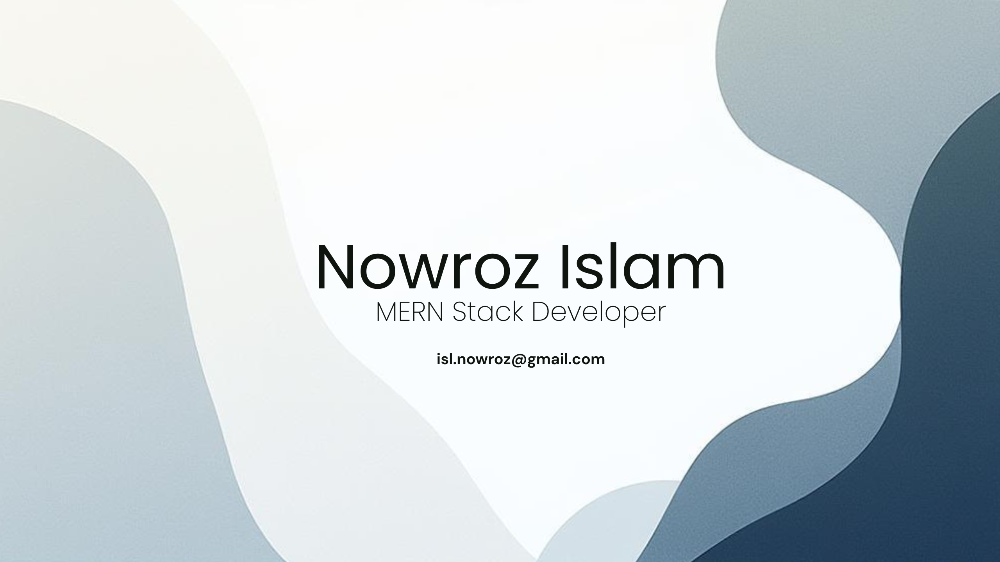

# Nowroz Islam

**`MERN Stack Developer`**

I am a dedicated MERN Stack Developer with a strong passion for building intuitive, reliable, and scalable web applications. With hands-on experience in JavaScript, React, Node.js, Express.js, and MongoDB, I enjoy bringing ideas to life across both the frontend and backend. I take pride in writing clean, maintainable code and managing all my work through command-line Git and GitHub, ensuring smooth version control and a clean development workflow.

Academically, I hold a Bachelor of Science in Computer Science and Engineering.

---

## Skillset

| Stack                                                                                              | Technologies                                                                                                  |
| :------------------------------------------------------------------------------------------------- | :------------------------------------------------------------------------------------------------------------ |
| ** Frontend** |  |
| ** Backend**   |            |
| ** Database** |                     |

##  Languages

## Tools

